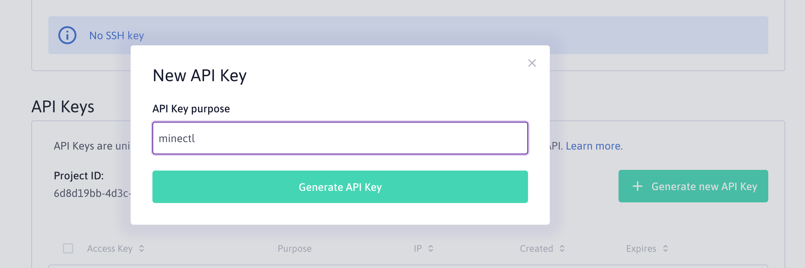
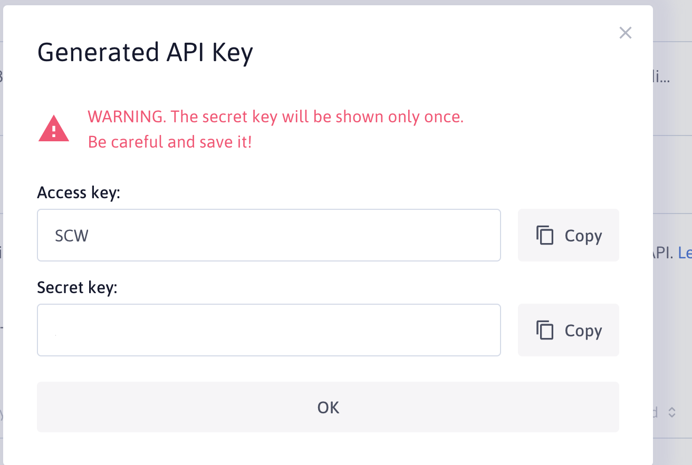
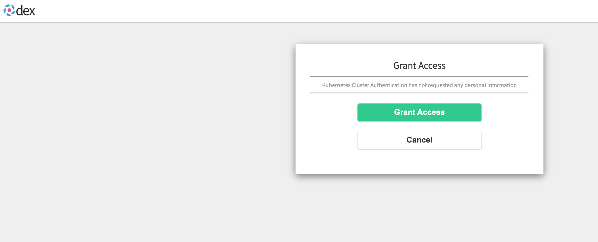

# Pulumi meets Scaleway

How to deploy a `Scaleway Kubernetes Kapsule` cluster with the new Pulumi Scaleway provider!

In this tutorial, we will burn a firework of cool stuff, just to celebrate the fact that we can finally use Pulumi to
deploy `Scaleway Kubernetes Kapsule` clusters.

So Engin, what are we going to do in this tutorial? Let me tell you the end result:

A `Scaleway Kapsule` cluster with OIDC authentication using Dex. On top on that, we will use cert-manager with DNS01
challenge rather the standard HTTP01 challenge to get us some nice `Let's Encrypt` certificates and of course 
external-dns to talk directly to `Scaleway DNS` service.

# Prerequisites

- You need to have a Scaleway account.
- You need to have a Domain registered in Scaleway, to use the DNS service from Scaleway. In this tutorial, I will use `dex.ediri.cloud` as a domain.

## Scaleway

Scaleway is a cloud provider with a variety of services. Scaleway Elements is their Cloud Platform offering, with
everything you need to run your workload in the Cloud. From virtual machines to serverless functions, you will find a
huge range of services.

You can quickly register here to get an [account](https://console.scaleway.com/register).

### Access and Secret Key

Generate a new access and secret key (https://console.scaleway.com/project/credentials)



Get the generated API keys.



Export the keys as ENV variables:

```
export ACCESS_KEY=xxx
export SECRET_KEY=yyy
export ORGANISATION_ID=zzz
```

See https://www.scaleway.com/en/docs/generate-api-keys/ for even more details on how Scaleway Credentials work.

## Pulumi

Pulumi is an open source infrastructure as code tool for creating, deploying, and managing cloud infrastructure. Pulumi
works with traditional infrastructure like VMs, networks, and databases, in addition to modern architectures, including
containers, Kubernetes clusters, and serverless functions. Pulumi supports dozens of public, private, and hybrid cloud
service providers.

In this tutorial, we will use for example golang as our programming language.

### Install Pulumi

Installing Pulumi is easy, just head over to the [get-stated](https://www.pulumi.com/docs/get-started/install/) website
and chose the appropriate version and way to download the cli. To store your state files, you can use their
free [SaaS](https://app.pulumi.com/signin?reason=401) offering

# Create the Pulumi infrastructure program

Let us start with the main Pulumi program. Just create run following commands in your terminal inside your project
folder:

```basj
pulumi new go
```

Follow the instructions to create a new project with golang as programing language and fill in the required information.

Pulumi offers plenty of templates, if you are unsure of what to use, just use type following command and choose from the 
huge collection of templates:

```bash
pulumi new
Please choose a template:  [Use arrows to move, enter to select, type to filter]
aws-csharp                   A minimal AWS C# Pulumi program
aws-go                       A minimal AWS Go Pulumi program
aws-javascript               A minimal AWS JavaScript Pulumi program
aws-python                   A minimal AWS Python Pulumi program
aws-typescript               A minimal AWS TypeScript Pulumi program
azure-csharp                 A minimal Azure Native C# Pulumi program
azure-go                     A minimal Azure Native Go Pulumi program
azure-javascript             A minimal JavaScript Pulumi program with the native Azure provider
azure-python                 A minimal Azure Native Python Pulumi program
....
```

## Add the Scaleway provider

The Scaleway provider binary is a third party binary. It can be installed using the pulumi plugin command.

```bash
pulumi plugin install resource scaleway v0.1.7 --server https://dl.briggs.work/pulumi/releases/plugins
```

Then you can add the go module via:

```bash
go get github.com/jaxxstorm/pulumi-scaleway/sdk/go/scaleway
```

And finally we add the Scaleway Credentials via following commands to the Pulumi config:

```bash
pulumi config set scaleway:access_key YYYY --secret
pulumi config set scaleway:secret_key ZZZZ --secret
```

More details -> https://www.pulumi.com/registry/packages/scaleway/

## The Scaleway Cert-Manager Webhook

To use the Cert-Manager webhook, we need to use the dedicated Scaleway Webhook. Currently, there is no Helm Chart for it,
so you need to clone the repo and install it.

For more convenient installation, I included the chart folder into this repository under `infrastructure/scaleway-webhook`

See https://github.com/scaleway/cert-manager-webhook-scaleway for the original code.

## The Scaleway Deployment

So let us put the pieces together, I will point only to some important parts of the code.

### OIDC

Enable OIDC authentication on the Scaleway Kapsule cluster via the property `OpenIdConnectConfig`

````go
OpenIdConnectConfig: &scaleway.KubernetesClusterOpenIdConnectConfigArgs{
    IssuerUrl:      pulumi.String("https://dex.ediri.cloud/dex"),
    ClientId:       pulumi.String("kubernetes"),
    UsernameClaim:  pulumi.String("preferred_username"),
    UsernamePrefix: pulumi.String("oidc:"),
},
````

As `IssuerUrl` is the URL of the OIDC provider, we need to add the `oidc:` prefix to the username. The client ID is
fixed to `kubernetes` and the username claim is fixed to `preferred_username`. We come later back to this, when we
configure dex

See https://kubernetes.io/docs/reference/access-authn-authz/authentication/#openid-connect-tokens for an indepth 
explanation of the OIDC configuration.

### Feature Gates

It's very easy to enable features in the `Kapsule` cluster. Just add the following property to  the `KubernetesClusterArgs`:

```go
FeatureGates: pulumi.StringArray{
pulumi.String("HPAScaleToZero"),
},
```

In this tutorial, I enabled the `HPAScaleToZero` feature.

See https://kubernetes.io/docs/reference/command-line-tools-reference/feature-gates/ for all the available feature gates

We will not actually use the `HPAScaleToZero` feature in this tutorial, but `HPAScaleToZero` enables setting minReplicas to 0 for 
`HorizontalPodAutoscaler` resources when using custom or external metrics.

### Auto-Scaling and Auto-Healing

I just want to use the Auto-Scaling feature of the `Kapsule` cluster. So I add the following property to the `KubernetesNodePoolArgs`

```go
Autoscaling: pulumi.Bool(true),
MinSize:     pulumi.Int(1),
MaxSize:     pulumi.Int(3),
Autohealing: pulumi.Bool(true),
```

Very easy, right?

There are much more features available, but I will not cover them here all. Go check the documentation in 
the [Pulumi Registry]( https://www.pulumi.com/registry/packages/scaleway/)

## The Pulumi Kubernetes provider

As we're going to deploy many Kubernetes resources, we need to add the `kubernetes` module to our go modules. Type the 
following command to install the Pulumi Kubernetes go module:

```
go get github.com/pulumi/pulumi-kubernetes/sdk/v3
```

To configure the Pulumi Kubernetes provider we need to add the following piece of code:

```go
provider, err := kubernetes.NewProvider(ctx, "kubernetes", &kubernetes.ProviderArgs{
Kubeconfig: cluster.Kubeconfigs.Index(pulumi.Int(0)).ConfigFile(),
}, pulumi.Parent(pool))
```

As you see, we use the output of the cluster, in this case the  `Kubeconfigs` to configure the `kubernetes` provider.

## Installing ingress-nginx

This is very straight forward. We use the Pulumi `NewRelease` resource to install the Ingress Nginx.

```go
ingress, err := helm.NewRelease(p.ctx, "ingress-nginx", &helm.ReleaseArgs{
    Name:            pulumi.String("ingress-nginx"),
    Chart:           pulumi.String("ingress-nginx"),
    Version:         pulumi.String("4.0.13"),
    Namespace:       pulumi.String("ingress-nginx"),
    CreateNamespace: pulumi.Bool(true),
    RepositoryOpts: helm.RepositoryOptsArgs{
        Repo: pulumi.String("https://kubernetes.github.io/ingress-nginx"),
    },
...
}, pulumi.Provider(p.provider))
```

Important here is to pass the `provider`, we create above, to the `helm.NewRelease` function.

## Installing cert-manager

Here we need to do a little more, because we need to install the Scaleway Webhook too. You remember the one we clone from
the repository! 

So we use the `helm.NewRelease` function to install the Cert-Manager.

```go
certManager, err := helm.NewRelease(p.ctx, "jetstack", &helm.ReleaseArgs{
    Name:            pulumi.String("cert-manager"),
    Chart:           pulumi.String("cert-manager"),
    Version:         pulumi.String("v1.6.1"),
    Namespace:       pulumi.String("cert-manager"),
    CreateNamespace: pulumi.Bool(true),
    RepositoryOpts: helm.RepositoryOptsArgs{
        Repo: pulumi.String("https://charts.jetstack.io"),
    },
...
}, pulumi.Provider(p.provider))
```

For the deployment of the webhook, we use the `helm.NewChart` function and point to our local folder with the installation the webhook chart.

```go
scw := config.New(p.ctx, "scaleway")
scaleWayWebHook, err := helm.NewChart(p.ctx, "scaleway-webhook", helm.ChartArgs{
    Path:      pulumi.String("./scaleway-webhook"),
    Chart:     pulumi.String("scaleway-webhook"),
    Namespace: pulumi.String("cert-manager"),
}, pulumi.Provider(p.provider), pulumi.Parent(certManager))
```

I added also a parent relation to the `cert-manager` release, to be sure the CRDs are installed before the webhook gets
installed.

Now we need to put this two piece of code together with the help of the `ClusterIssuer` resource. This resource is
also complete written in go!

But before, we need to create a kubernetes `secret` to store the Scaleway Credentials. As I already stored them in the Pulumi
config, I can easily access them and create the secret.

```go
webhookSecret, err := v1.NewSecret(p.ctx, "webhook-dns-credentials", &v1.SecretArgs{
    Metadata: &metav1.ObjectMetaArgs{
        Name:      pulumi.String("webhook-dns-credentials"),
        Namespace: pulumi.String("cert-manager"),
    },
    StringData: pulumi.StringMap{
        "access_key": pulumi.String(scw.Get("access_key")),
        "secret_key": pulumi.String(scw.Get("secret_key")),
    },
    Type: pulumi.String("Opaque"),
}, pulumi.Provider(p.provider), pulumi.Parent(certManager))
...
_, err = apiextensions.NewCustomResource(p.ctx, "letsencrypt-staging", &apiextensions.CustomResourceArgs{
		Metadata: &metav1.ObjectMetaArgs{
			Name: pulumi.String("letsencrypt-staging"),
		},
		ApiVersion: pulumi.String("cert-manager.io/v1"),
		Kind:       pulumi.String("ClusterIssuer"),
		OtherFields: kubernetes.UntypedArgs{
			"spec": &pulumi.Map{
				"acme": pulumi.Map{
					"server": pulumi.String("https://acme-v02.api.letsencrypt.org/directory"),
					//"server": pulumi.String("https://acme-staging-v02.api.letsencrypt.org/directory"),
					"email": pulumi.String("info@ediri.de"),
					"privateKeySecretRef": pulumi.StringMap{
						"name": pulumi.String("letsencrypt-staging"),
					},
					"solvers": pulumi.Array{
						pulumi.Map{
							"dns01": pulumi.Map{
								"webhook": pulumi.Map{
									"groupName":  pulumi.String("acme.scaleway.com"),
									"solverName": pulumi.String("scaleway"),
									"config": pulumi.Map{
										"accessKeySecretRef": pulumi.Map{
											"key":  pulumi.String("access_key"),
											"name": pulumi.String("webhook-dns-credentials"),
										},
										"secretKeySecretRef": pulumi.Map{
											"key":  pulumi.String("secret_key"),
											"name": pulumi.String("webhook-dns-credentials"),
										},
									},
								},
							},
						},
					},
				},
			},
		},
	}, pulumi.Provider(p.provider), pulumi.Parent(certManager), pulumi.Parent(webhookSecret), pulumi.Parent(scaleWayWebHook))
```

Uff, that was a lot of work! As you see, we reference the secret with the `webhook-dns-credentials` name,
to get the access and secret key.

See https://cert-manager.io/docs/configuration/acme/dns01/ for details on how to configure the webhook for other DNS providers.

## Installing external-dns

Similar, to the others, we use the `helm.NewRelease` function to install the external-dns. The only thing to mention is,
that we need to set the provider to scaleway. And again, we will create a secret, to pass the Scaleway credentials.

```go
scw := config.New(p.ctx, "scaleway")

scalewaySecret, err := v1.NewSecret(p.ctx, "external-dns-credentials", &v1.SecretArgs{
    Metadata: &metav1.ObjectMetaArgs{
        Name:      pulumi.String("external-dns-credentials"),
        Namespace: externalDNSNS.Metadata.Name(),
    },
    StringData: pulumi.StringMap{
        "access_key": pulumi.String(scw.Get("access_key")),
        "secret_key": pulumi.String(scw.Get("secret_key")),
    },
    Type: pulumi.String("Opaque"),
}, pulumi.Provider(p.provider), pulumi.Parent(externalDNSNS))
...
_, err = helm.NewRelease(p.ctx, "external-dns", &helm.ReleaseArgs{
		Name:            pulumi.String("external-dns"),
		Chart:           pulumi.String("external-dns"),
		Version:         pulumi.String("1.7.1"),
		Namespace:       externalDNSNS.Metadata.Name(),
		CreateNamespace: pulumi.Bool(false),
		RepositoryOpts: helm.RepositoryOptsArgs{
			Repo: pulumi.String("https://kubernetes-sigs.github.io/external-dns"),
		},
		Values: pulumi.Map{
			"env": pulumi.Array{
				pulumi.Map{
					"name": pulumi.String("SCW_ACCESS_KEY"),
					"valueFrom": pulumi.Map{
						"secretKeyRef": pulumi.Map{
							"name": scalewaySecret.Metadata.Name(),
							"key":  pulumi.String("access_key"),
						},
					},
				},
				pulumi.Map{
					"name": pulumi.String("SCW_SECRET_KEY"),
					"valueFrom": pulumi.Map{
						"secretKeyRef": pulumi.Map{
							"name": scalewaySecret.Metadata.Name(),
							"key":  pulumi.String("secret_key"),
						},
					},
				},
			},
			"serviceMonitor": pulumi.Map{
				"enabled": pulumi.Bool(false),
				"additionalLabels": pulumi.Map{
					"app": pulumi.String("external-dns"),
				},
			},
			"provider": pulumi.String("scaleway"),
			"domainFilters": pulumi.Array{
				pulumi.String("ediri.cloud"),
			},
			"sources": pulumi.Array{
				pulumi.String("ingress"),
			},
		},
	}, pulumi.Provider(p.provider), pulumi.Parent(externalDNSNS))
```

## Installing Dex

Now we prepared everything to finally deploy Dex, with an TLS enabled Ingress. We're going to use GitHub as our OAuth2 provider,
so we need first create an OAuth2 application in GitHub

Follow the steps here -> https://docs.github.com/en/developers/apps/building-oauth-apps/creating-an-oauth-app

The only important part here is to set the callback to `https://<domain>/dex/callback`.

Then you can copy the generated clientID and clientSecret and save them via the pulumi cli to the config.

```bash
pulumi config set clientId FFFF --secret
pulumi config set clientSecret RRRR --secret      
```

We will use this to configure the dex deployment.

Let us see some parts of the values for the HelmRelease function:

```go
...
    Values: pulumi.Map{
        "config": pulumi.Map{
            "issuer": pulumi.String("https://dex.ediri.cloud/dex"),
            "storage": pulumi.Map{
                "type": pulumi.String("memory"),
            },
            "web": pulumi.Map{
                "http": pulumi.String("0.0.0.0:5556"),
                "frontend": pulumi.Map{
                    "theme":     pulumi.String("coreos"),
                    "issuer":    pulumi.String("ediri.cloud"),
                    "issuerUrl": pulumi.String("https://dex.ediri.cloud"),
                },
            },
            "connectors": pulumi.Array{
                pulumi.Map{
                    "type": pulumi.String("github"),
                    "id":   pulumi.String("github"),
                    "name": pulumi.String("GitHub"),
                    "config": pulumi.Map{
                        "clientID":     config.RequireSecret(p.ctx, "clientId"),
                        "clientSecret": config.RequireSecret(p.ctx, "clientSecret"),
                        "redirectURI":  pulumi.String("https://dex.ediri.cloud/dex/callback"),
                        "useLoginAsID": pulumi.Bool(true),
                    },
                },
            },
            "staticClients": pulumi.Array{
                pulumi.Map{
                    "id":     pulumi.String("kubernetes"),
                    "name":   pulumi.String("Kubernetes Cluster Authentication"),
                    "secret": pulumi.String("password"),
                    "redirectURIs": pulumi.Array{
                        pulumi.String("http://localhost:8000"),
                    },
                },
            },
        },
        "ingress": pulumi.Map{
            "className": pulumi.String("nginx"),
            "hosts": pulumi.Array{
                pulumi.Map{
                    "host": pulumi.String("dex.ediri.cloud"),
                    "paths": pulumi.Array{
                        pulumi.Map{
                            "path":     pulumi.String("/"),
                            "pathType": pulumi.String("ImplementationSpecific"),
                        },
                    },
                },
            },
            "enabled": pulumi.Bool(true),
            "tls": pulumi.Array{
                pulumi.Map{
                    "hosts": pulumi.Array{
                        pulumi.String("dex.ediri.cloud"),
                    },
                    "secretName": pulumi.String("dex-tls"),
                },
            },
            "annotations": pulumi.Map{
                "external-dns.alpha.kubernetes.io/hostname": pulumi.String("dex.ediri.cloud"),
                "external-dns.alpha.kubernetes.io/ttl":      pulumi.String("60"),
            },
        },
    },
...
```

In the config property, we set the connector to `github` and the clientID and clientSecret to the values we saved earlier.
Plus we enable the ingress and set the hostname to `dex.ediri.cloud`. 

See https://dexidp.io/docs/connectors/github/ for more information about the GitHub connector.

# Deploy everything

Now we can deploy everything, just run the following command:

```bash
pulumi up
```

You can run the preview command to see any potential changes beforehand with following command:

```bash
pulumi preview
```

# Test everything

If everyting is working, we can configure our kubectl to use OIDC authentication. To facilitate this, we will use
[kubelogin](https://github.com/int128/kubelogin)

Run following command to setup kubelogin:

```bash
kubectl oidc-login setup --oidc-issuer-url https://dex.ediri.cloud/dex --oidc-client-id kubernetes --oidc-client-secret password 
```



You will be redirected to Dex. And Dex will redirect you to GitHub. After the successful login, you will see some instruction on
how to configure kubelogin.

Or you just add this to your kubeconfig:

```yaml
...
- name: oidc
  user:
    exec:
      apiVersion: client.authentication.k8s.io/v1beta1
      args:
      - oidc-login
      - get-token
      - --oidc-issuer-url=https://dex.ediri.cloud/dex
      - --oidc-client-id=kubernetes
      - --oidc-client-secret=password
      - --oidc-extra-scope=groups,profile
      command: kubectl
      env: null
      provideClusterInfo: false
...
```

As we want to use the preferred username as the user name, we need to add the following to oidc-login config `- --oidc-extra-scope=groups,profile`
This will give us the `preferred_username` as the user name.

To test you can run the following command:

```bash
➜  pulumi-scaleway git:(main) ✗ k --user=oidc get nodes
NAME                                             STATUS   ROLES    AGE   VERSION
scw-pulumi-kapsule-pulumi-kapsule-pool-a3c94a6   Ready    <none>   25h   v1.23.0
```

# Github Action

To use [Github Pulumi CLI Action](https://github.com/marketplace/actions/pulumi-cli-action), you need to add the following to your Github Action:

```yaml
...
  - uses: pulumi/actions@v3
    with:
      command: preview
      stack-name: dev
      comment-on-pr: true
      github-token: ${{ secrets.GITHUB_TOKEN }}
    env:
      PULUMI_ACCESS_TOKEN: ${{ secrets.PULUMI_ACCESS_TOKEN }}
...
```

More details you can find here -> https://www.pulumi.com/docs/guides/continuous-delivery/github-actions/

# Recap

That was really much ground we covered here. But you can see, how easily you can deploy now Scaleway Services via Pulumi.